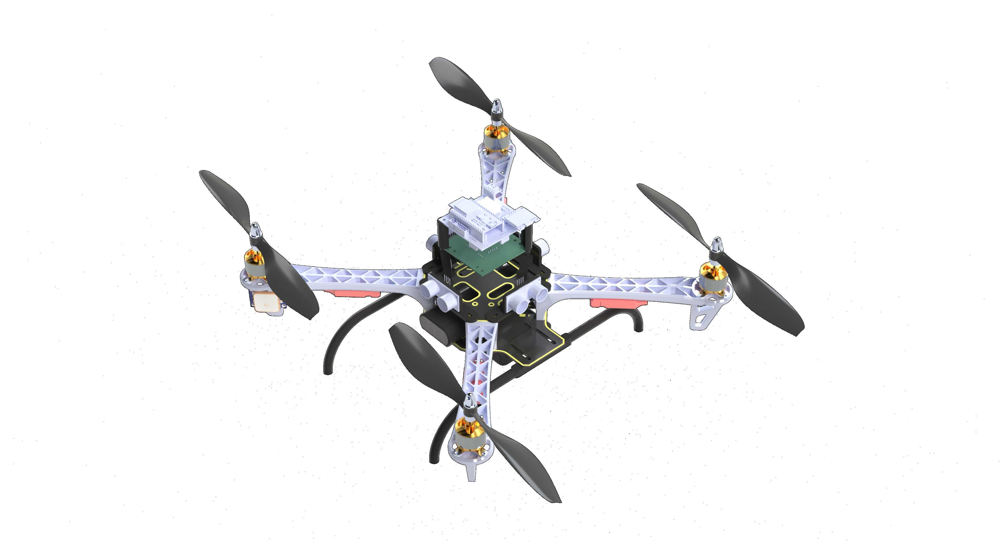

# Multirotor-ROS

|  |
|---|

Plataforma de adquisición de datos de un multirotor con ESP32 y ROS2

## Software y Hardware 

<details>
    <summary>Software</summary>

* [ROS2 Jazzy](https://index.ros.org/p/desktop_full/#jazzy)
* [Gazebo Harmonic](https://gazebosim.org/docs/harmonic/getstarted/)
* [uROS Jazzy](https://github.com/micro-ROS/micro_ros_setup/tree/jazzy)
* [uROS Arduino Jazzy](https://github.com/micro-ROS/micro_ros_arduino/tree/jazzy)
* [KiCad](https://www.kicad.org)

</details>

<details>
    <summary>Componentes electrónicos</summary>

* 1 [ESP-WROOM-32 Devkit](https://www.amazon.com/-/es/ESP32-DevKitC-ESP32-WROOM-32-ESP32-WROVER/dp/B07W6F2Z3K)
* 1 Módulo IMU [MPU6050](https://www.amazon.com/-/es/MPU6050-Accelerometer-Gyroscope-Module-Arduino/dp/B00KQK8X2A)
* 1 Módulo GPS [NEO-6M](https://www.amazon.com/-/es/NEO-6M-GPS-Module-For-Arduino/dp/B00KQK8X2A)
* 1 Sensor de temp. y humedad [DHT22](https://www.amazon.com/-/es/DHT11-Temperature-Humidity-Sensor-Arduino/dp/B00KQK8X2A)
* 1 Resistencia de 10KΩ
* 1 Módulo [BMP280](https://www.amazon.com/-/es/BME280-Temperature-Humidity-Barometric-Pressure/dp/B00KQK8X2A)
* 4 Módulos sensores de distancia [HC-SR04](https://www.amazon.com/-/es/HC-SR04-Ultrasonic-Distance-Transducer-Arduino/dp/B00KQK8X2A)
* 1 Pantalla [OLED 0.96"](https://www.amazon.com/-/es/0-96-Inch-OLED-Display-Arduino/dp/B00KQK8X2A)
* 4 Motores brushless [1000KV](https://www.amazon.com/-/es/Brushless-Motor-1000KV-Drone-Quadcopter/dp/B00KQK8X2A)
* 4 Controladores de velocidad [(ESC) 30A](https://www.amazon.com/-/es/Brushless-Controller-30A-Quadcopter-Multicopter/dp/B00KQK8X2A)
* 1 Batería LiPo [2S 4Ah](https://www.amazon.com/-/es/LiPo-Battery-2200mAh-3S-11-1V/dp/B00KQK8X2A)
* 1 Powerbank [30A 3.7V](https://www.amazon.com/-/es/Power-Bank-3-7V-30A/dp/B00KQK8X2A)

</details>

<details>
    <summary>Componentes mecánicos</summary>

* 1 Chasis de multirotor [F450](https://www.amazon.com/-/es/F450-Quadcopter-Frame-Kit-Quadcopter/dp/B00KQK8X2A)
* 4 Hélices [1045](https://www.amazon.com/-/es/1045-Propeller-Quadcopter-Multicopter-Drone/dp/B00KQK8X2A)
* Piezas impresas en 3D

</details>

## Instalación
Es posible instalar el software de [ROS2](https://docs.ros.org/en/jazzy/index.html), [Gazebo](https://gazebosim.org/docs/harmonic/install/) y [micro-ROS](https://micro.ros.org/docs/tutorials/core/overview/) siguiendo los pasos de la documentación oficial o con el script de instalación [install-ros.sh](./src/install-ros.sh):

```shell
$SHELL ./src/install-ros.sh
```


## Espacio de trabajo (ROS2)
[ros-ws](ros-ws) es el espacio de trabajo de ROS2 donde se compila el paquete `fdrone` usando para visualizar y simular el multirotor en Gazebo.

```shell
cd ros-ws
colcon build
```

### Lanzador
El lanzador `display.launch.py` se encarga de visualizar el modelo en RVIZ y Gazebo.

```shell
source install/setup.$(echo $SHELL | awk -F '/' '{print $NF}')
ros2 launch fdrone display.launch.py
```

### Interfaz de usuario
El script `vel_put.py` se desarrolló para enviar velocidades al multirotor desde la terminal enviando valores de tipo `Float64` a tópicos puenteados entre ROS2 y Gazebo.

```shell
source install/setup.$(echo $SHELL | awk -F '/' '{print $NF}')
ros2 run fdrone vel_put.py
```

## Electrónica
[electronic](electronic) contiene el esquema eléctrico de la PCB principal.

|  |  |
|---|---|
